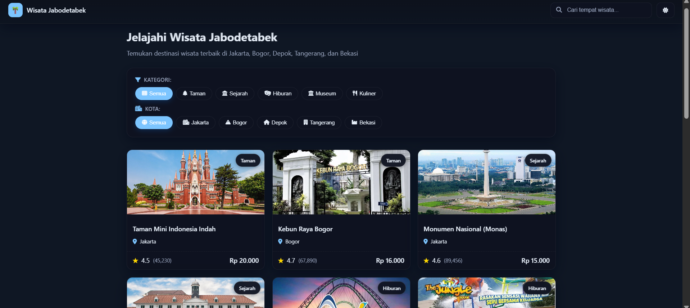
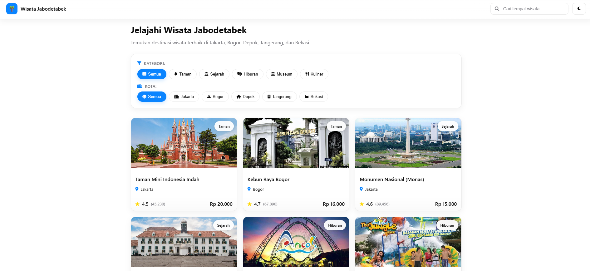
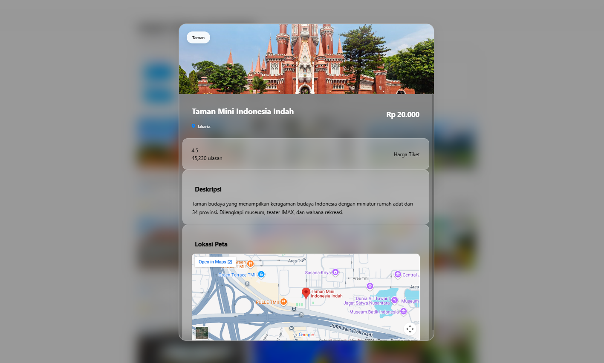

# 🌴 Wisata Jabodetabek

Website katalog wisata Jabodetabek yang membantu pengguna menemukan berbagai destinasi wisata di **Jakarta, Bogor, Depok, Tangerang, dan Bekasi** berdasarkan kategori dan lokasi.

Website dibuat dengan tampilan modern, responsif, serta menyediakan fitur pencarian, filter wisata, detail destinasi, peta lokasi, dan pilihan tema terang/gelap.

## ✨ Preview

### Dark Mode
<p align="center">
  
</p>

### Light Mode
<p align="center">
  
</p>

### Detail Destinasi
<p align="center">
  
</p>

## 🚀 Fitur

- 🔎 **Pencarian wisata** berdasarkan nama tempat
- 🏷️ **Filter kategori**:
  - Taman
  - Sejarah
  - Hiburan
  - Museum
  - Kuliner
- 📍 **Filter berdasarkan kota**:
  - Jakarta
  - Bogor
  - Depok
  - Tangerang
  - Bekasi
- ⭐ Menampilkan **rating dan jumlah ulasan**
- 💰 Menampilkan **harga tiket**
- 🖼️ Kartu destinasi dengan gambar dan informasi singkat
- 📋 **Detail destinasi** dalam tampilan modal
- 🗺️ **Peta lokasi** destinasi
- 🌙 **Dark Mode / Light Mode**
- 📱 Tampilan **responsive** untuk berbagai ukuran layar

## 🛠️ Teknologi

- **HTML5** — struktur halaman
- **CSS3** — desain, layout, responsive UI, dan tema
- **JavaScript** — pencarian, filter, modal detail, dan interaksi halaman
- **Google Maps** — menampilkan lokasi destinasi

## 📂 Struktur Folder

```text
Web Wisata Jabodetabek/
├── images/
│   └── ...                 # Gambar destinasi
├── Screenshot/
│   ├── preview-dark.png
│   ├── preview-light.png
│   └── detail-tmii.png
├── index.html
├── script.js
├── style.css
└── README.md
```

## ▶️ Cara Menjalankan

Karena website menggunakan HTML, CSS, dan JavaScript, website dapat dijalankan langsung di browser.

1. Clone repository:

```bash
git clone https://github.com/USERNAME/REPOSITORY.git
```

2. Masuk ke folder project:

```bash
cd "Web Wisata Jabodetabek"
```

3. Buka file `index.html` menggunakan browser.

> **Catatan:** Ganti `USERNAME/REPOSITORY` dengan username GitHub dan nama repository kamu.

## 📌 Contoh Destinasi

Beberapa destinasi yang ditampilkan dalam website:

- Taman Mini Indonesia Indah — Jakarta
- Kebun Raya Bogor — Bogor
- Monumen Nasional (Monas) — Jakarta
- Museum Fatahillah — Jakarta
- Ancol — Jakarta
- The Jungle Water Adventure — Bogor

## 🎯 Tujuan Project

Project ini dibuat sebagai website informasi wisata yang memudahkan pengguna dalam **mencari, memfilter, dan melihat informasi destinasi wisata di wilayah Jabodetabek** dalam satu halaman yang sederhana dan mudah digunakan.

## 👨‍💻 Author

**Fakhriy**

Mahasiswa Sistem Informasi — Universitas Gunadarma

---

⭐ Jika project ini bermanfaat, jangan lupa berikan **Star** pada repository.
